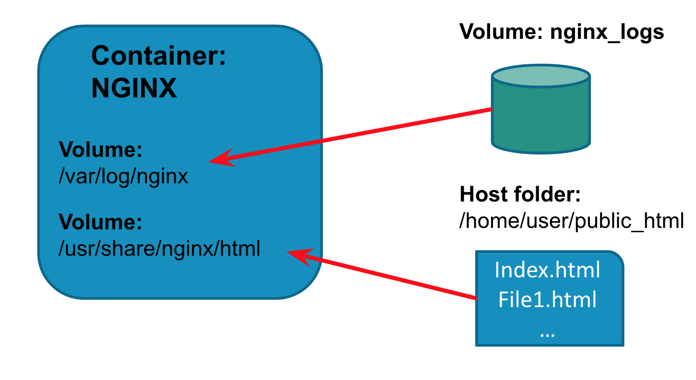

## Working with Volumes

At the end of this lesson, you will be able to:
* Explain what volumes are and what they are used for
* Learn the different methods of mounting a volume in a container
* Mount volumes during the docker run command and also in a Dockerfile
* Explain how data containers work
* Create some data containers

----

### Volumes
A Volume is a designated directory in a container, which is designed to persist data, independent of the container’s life cycle

* Volume changes are excluded when updating an image
* Persist when a container is deleted
* Can be mapped to a host folder
* Can be shared between containers

----

### Working with Volumes
Docker volumes can be used:
* De-couple the data that is stored, from the container which created the data
* Bypassing the copy-on-write system to obtain native disk I/O performance.
* Bypassing copy-on-write to leave some files out of docker commit.
* Sharing a directory between multiple containers.
* Sharing a directory between the host and a container.
* Sharing a single file between the host and a container

----

### Docker volume command

The `docker volume` command contains a number of sub commands used to create and manage volumes
Commands are 
```
docker volume create
docker volume ls
docker volume inspect
docker volume rm
```

----

### Creating a volume

* Use the `docker volume create` command and specify the `--name` option
* Specify a name so you can easily find and identify your volume later

```
docker volume create --name test1
```

----

### Listing volumes

* Use `docker volume ls` command to display a list of all volumes
* This includes volumes that were mounted to containers using the old `docker run -v` method 
* Volumes that were not given a name during creation will have a randomly generated name

```
DRIVER              VOLUME NAME
local               045e85912e993e65cd00ebd4d39df8243c7baa064472d6297701746a41927807
local               06ea6a799cee6f79a09a85d5e65b996ffe594427cc1faf60f8908a2c76632d31
local               files
local               hello.php
local               https
```

----

### Mount a Volume

* Volumes can be mounted when running a container
* Use the `-v` option on `docker run` command and specify the name of the volume and the mount path syntax: `docker run -v <name>:<path> …`
* Path is the container folder where you want to mount the volume
* Can mount multiple volumes by using the `-v` option multiple times

----

### Do it yourself #1

* Create a volume called test1
```
docker volume create --name test1
```
* Run `docker volume ls` and verify that you can see your `test1` volume
* Execute a new Ubuntu container and mount the test1 volume. Map it to the path `/www/website` and run bash as your process 
```
docker run -it -v test1:/www/website ubuntu bash
```

----

* Inside the container, verify that you can get to `/www/website` 
```
cd /www/website
```
* Create a file called test.txt inside the `/www/website` folder
```
touch test.txt
```
* Detach from the container `CTRL + P + Q`
* Commit the updated container as a new image called test and tag it as 1.0
```
docker commit <container ID> test:1.0
```

----

* Execute a new container with your test image and go into it’s bash shell
```
docker run -it test:1.0 bash
```
* Verify that the `/www/website` folder exists and that there are no files inside
* Exit the container
```
exit
```
* Run docker ps to ensure that your first container is still running

----

### Where are your volumes?

* Volumes exist independently from containers
* If a container is stopped, we can still access our volume
* To find where the volume is use `docker inspect` on the container and look for the “source” field as shown below

```
"Mounts": [
            {
                "Name": "test1",
                "Source": "/var/lib/docker/volumes/test1/_data",
                "Destination": "/www/website",
                "Driver": "local",
                "Mode": "z",
                "RW": true,
                "Propagation": "rprivate"
            }
        ],
```

----

### Docker volume inspect command

* The `docker volume inspect` command shows all the information about a specified volume
* Information includes the “Mountpoint” which tells us where the volume is located on the host

```
docker volume inspect test1
[
    {
        "Name": "test1",
        "Driver": "local",
        "Mountpoint": "/var/lib/docker/volumes/test1/_data",
        "Labels": {},
        "Scope": "local"
    }
]
```

----

### Deleting a volume

* Volumes are not deleted when you delete a container
* Use `docker volume rm` to delete a volume

Delete the volume called test1
```
docker volume rm test1
```
First remove the container, then try again
```
docker rm -f <container ID>
docker volume rm test1
```

----

### Deleting volumes

* You cannot delete a volume if it is being used by a container
    * Doesn’t matter if the container is running or stopped
* Must delete all containers first

----

### Do it yourself (homework)

* Delete the container from exercise #1 without using any options 
```
docker rm <container ID>
```
* Run `docker volume ls` and check the result 
* Notice  our test1 volume is still present
* Elevate your user privaleges
```
sudo su
```

----

* Change directory to the volume path and check to see that the test.txt and test2.txt files are still present (only Linux)
```
cd /var/lib/docker/volumes/test1/_data
ls
```
* Exit superuser
```
exit
```
* Delete the `test1` volume
```
docker volume rm test1
```
* Run docker volume ls and make sure the test1 volume is no longer displayed

----

### Mounting host folders to a volume

* When running a container, you can map folders on the host to a volume 
* The files from the host folder will be present in the volume
* Changes made on the host are reflected inside the container volume
* Syntax
```
docker run -v [host path]:[container path]:[rw|ro]
```
* rw or ro controls the write status of the volume

----

### Simple Example

* In the example below, files inside `/some/html/files` on the hosts will appear in the `/data/www` folder of the container
* If the host path or container path does not exist, it will be created
* If the container path is a folder with existing content, the files will be replaced by those from the host path

Mount the contents of the public_html folder on the hosts to the container volume at /data/www
```
docker run -d -v /some/html/files:/data/www ubuntu
```

----

### Do it yourself

* In your home directory, create a public_html folder and create an index.html file inside this folder
* Run an Ubuntu container and mount the public_html folder to the volume /data/www
```
docker run -it -v /home/csuser/public_html:/data/www ubuntu
```
* In the container, look inside the /data/www folder and verify you can see the index.html file
* Exit the container without stopping it
```
CTRL + P + Q
```

----

* Modify the index.html file on the host by adding some new lines
* Attach to the container and check the index.html file inside /data/www for the changes 

----

### A data persistence example with NGINX

* Let’s run an NGINX container and have it serve web pages that we have on the host machine
* That way we can conveniently edit the page on the host instead of having to make changes inside the container
* Mount a volume to the NGINX folder where logs are written to. This way we can persist the log files

----

* Quick NGINX 101
    * NGINX starts with a one default server on port 80
    * Default location for pages is the /usr/share/nginx/html folder
    * By default the folder has an index.html file which is the welcome page
    * Log files are written to the /var/log/nginx folder

----

### Diagram of example



----

### Running the container

* When we visit our server URL we should now see our index.html file inside our public_html folder instead of the default NGINX welcome page

Run an nginx container and map the our public_html folder to the volume at the /usr/share/nginx/html folder in the container.
```
docker run -d -p 8001:80 -v /home/csuser/public_html:/usr/share/nginx/html nginx
```

----

### Do it yourself (homework)

* Create a volume called nginx_logs
* docker volume create --name nginx_logs
* Run an NGINX container and map your public_html folder to a volume at `/usr/share/nginx/html`. Also mount your `nginx_logs` volume to the `/var/log/nginx` folder. Name the container nginx_server
```
docker run -d -P --name nginx_server \
	-v ~/public_html:/usr/share/nginx/html \
	-v nginx_logs:/var/log/nginx \
	nginx
```
Get terminal access to your container
```
docker exec -it nginx_server bash
```

----

* Check the `/usr/share/nginx/html` folder for your index.html file and then exit the terminal
* Run `docker ps` to find the host port which is mapped to port 80 on the container
* On your browser, access your AWS server URL and specify the port from above
* Verify you can see the contents of your index.html file from your public_html folder
* Now modify your index.html file
* Refresh your browser and verify that you can see the changes

----

### Use cases for mounting host directories

You want to manage storage and snapshots yourself.
* With LVM, or a SAN, or ZFS, or?
* You have a separate disk with better performance (SSD) or resiliency (EBS) than the system disk, and you want to put important data on that disk.
* You want to share your source directory between your host (where the source gets edited) and the container (where it is compiled or executed).
    * Good for testing purposes but not for production deployment

----

### Sharing data between containers

* Volumes can be mounted into multiple containers
* Allows data to be shared between containers
* Example use cases
    * One container writes metric data to the volume
    * Another container runs an application to read the data and generate graphs
Note: Be aware of potential conflicts if multiple applications are allowed write access into the same volume

----

### Volumes in Dockerfile

* VOLUME instruction creates a mount point
* Can specify arguments in a JSON array or string
* Cannot map volumes to host directories
* Volumes are initialized when the container is executed

```
String example
VOLUME /myvol

String example with multiple volumes
VOLUME /www/website1.com /www/website2.com

JSON example
VOLUME [“myvol”, “myvol2”]
```

----

### Example Dockerfile with Volumes

* When we run a container from this image, the volume will be initialized along with any data in the specified location
* If we want to setup default files in the volume folder, the folder and file must be created first

```
FROM ubuntu

RUN apt-get update && apt-get install -y vim wget

RUN mkdir /data/myvol -p && echo "hello world" > /data/myvol/testfile
VOLUME ["/data/myvol"]
```

----

### Module summary

* Volumes are created with the docker volume create command
* Volumes can be mounted when we run a container during the docker run command or in a Dockerfile
* Volumes bypass the copy on write system
* We can map a host directory to a volume in a container
* A volume persists even after its container has been deleted

----

  * [Next up, Containerize our service](./05_our-service.md)

  * or continue with more exercises...

----


### Do it yourself (Homework)

* Run `docker volume inspect` on the test1 volume
```
docker volume inspect test1
```
* Copy the path specified by the Mountpoint field. The path should be 
```
/var/lib/docker/volumes/test1/_data
```
* Elevate your user privileges to root
```
sudo su
```
* Change directory into the volume path in step 2 (will only work in Linux)
```
cd /var/lib/docker/volumes/test1/_data
```

----

* Run `ls` and verify you can see the `test.txt` file

* Create another file called test2.text
```
touch test2.txt
```
* Exit the superuser account
```
exit
```
* Use docker exec to log back into the shell of your Ubuntu container that is still running
```
docker exec -it <container name> bash
```
or
```
docker attach <container name>
```

----

* Change directory into the /www/website folder 
Verify that you can see both the test.txt and test2.txt files

----

### Data containers

* A data container is a container created for the purpose of referencing one or many volumes
* Data containers don’t run any application or process
* Used when you have persistent data that needs to be shared with other containers 
* When creating a data container, you should give it a custom name to make it easier to reference

----

### Creating data containers 

* We just need to run a container and specify a volume
* Should run a container using a lightweight image such as busybox
* No need to run any particular process, just run `“true”`

Run our data container using the busybox image
```
docker run --name mydata -v /data/app1 busybox true
```

----

### Using data containers

* Data containers can be used by other containers via the 
    * `--volumes-from` option in the docker run command
* Reference your data container by its container name. For example: 
    * `--volumes-from datacontainer …`

----

### Backup your data containers

* It’s a good idea to back up data containers such as our logdata container, which has our NGINX log files
* Backups can be done with the following process:
    * Create a new container and mount the volumes from the data container
    * Mount a host directory as another volume on the container
    * Run the tar process to backup the data container volume onto your host folder

